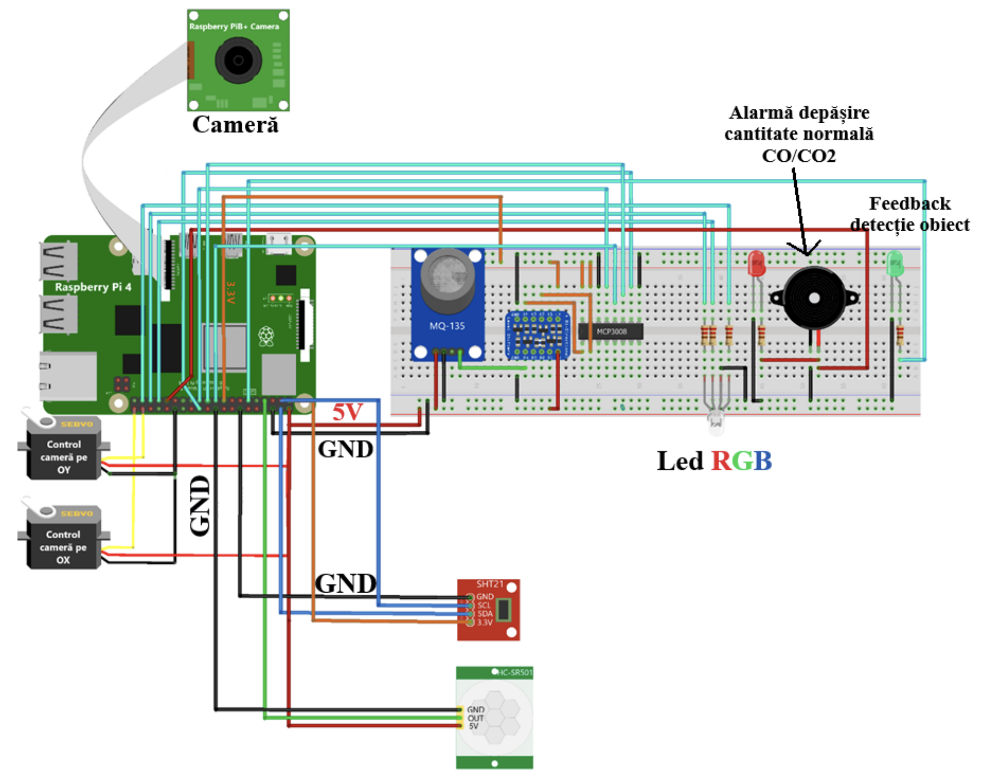

# 🚀 Home Monitoring System with Raspberry Pi 4 🚀

Welcome to my Raspberry Pi 4 thesis project on Home Monitoring System! This repository contains the source code for my undergraduate thesis, where I have developed a smart home monitoring system using Raspberry Pi 4 and web technologies [html, css, jquery, firebase, python, nodeJS].

## 🔗 Project Overview

The goal of this project is to create a cost-effective and versatile home monitoring system that allows users to remotely monitor their home's environment. The system is designed to collect data from various sensors, such as temperature, humidity, and motion detectors, and provide real-time updates and alerts to users through a web interface.

## 🌐 Features

- Real-time monitoring of temperature, humidity, and motion in different rooms of the house.
- Web-based user interface to access and visualize the collected data.
- Remote control of connected devices, such as smart plugs and lights.
- Responsive design

## 🔧 Technologies Used

- Raspberry Pi 4: As the central processing unit for data collection and analysis.
- Python: For interfacing with sensors and data processing.
- HTML, CSS, and JavaScript(jquery): For building the web-based user interface.

## 🔧 Installation and Setup

1. Clone this repository to your Raspberry Pi 4.
2. Install the necessary dependencies using `npm` (for web interface).
3. Connect the sensors (temperature, humidity, motion detectors) to the Raspberry Pi's GPIO pins as per the provided circuit diagram.
4. Run the Python script to start data collection and processing [python python-project.py].
5. Run the node JS server using `node app.js` in `/web-app-licenta`
6. Launch the web interface by serving the HTML, CSS, and JavaScript

## 🌐 Usage

- Access the web interface by opening a web browser and entering the Raspberry Pi's IP address.
- Monitor real-time data and environmental conditions in different rooms of your home.
- Control connected devices remotely through the web interface.

## 📸 Screenshots

